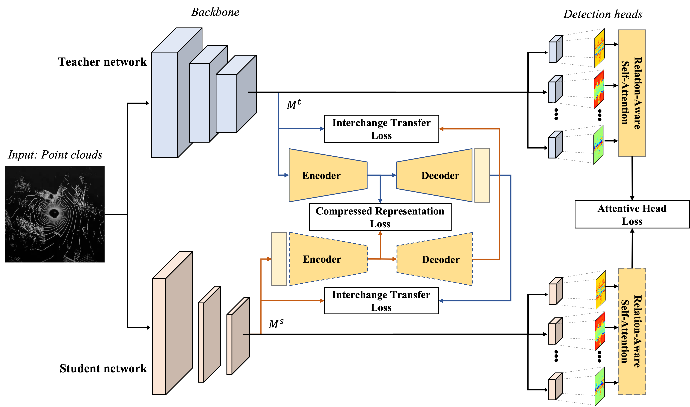

# interchange transfer based knowledge distillation for 3D object detection

A knowledge distillation method for point cloud based 3D object detection

  

> [**itKD: Interchange Transfer-based Knowledge Distillation for 3D Object Detection**](https://arxiv.org/abs/2205.15531),            
> Hyeon Cho, Junyong Choi, Geonwoo Baek, Wonjun Hwang
